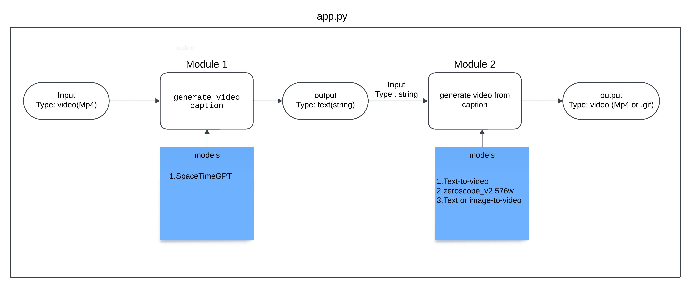
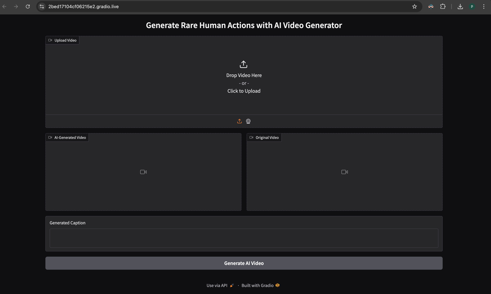
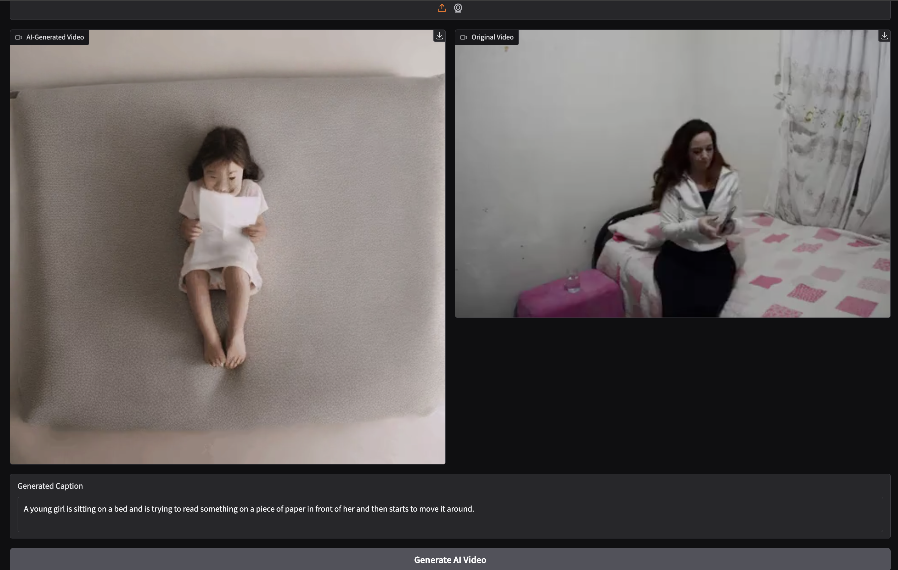

# AI-video-Generator
Set up and generate rare-human actions with AI video generator

# Work Flow


# Models(  generate caption from video)
  - [SpaceTimeGPT](https://huggingface.co/Neleac/SpaceTimeGPT)

# Models ( text to video generator models) 
 - [Text-to-video](https://huggingface.co/docs/diffusers/api/pipelines/text_to_video)
 - [zeroscope_v2 576w](https://huggingface.co/cerspense/zeroscope_v2_576w)
 - [Text or image-to-video](https://huggingface.co/docs/diffusers/using-diffusers/text-img2vid)

   
# Steps 
  ## Step 1: setup the environment 💻
```bash
git clone https://github.com/Abhijit7979/AI-video-Generator.git
conda env create -f environment.yml
conda activate GenAI
```
  ##  Step 2: navigate to app.py 🏃‍♂️
```bash
cd AI-video-Generator/src
python app.py
```
##  Step 3: Open Gradio interface 👌



``` sample_synthetic_videos/0BNML.mp4 ```
upload video file  and click on Generate Ai Video button 

## Step 4: ✨ Ai Generated Video ✨

output using Text or image-to-video model
## Team Members 
 - [Abhijit Rao](https://github.com/Abhijit7979)
 - [Chetan](https://github.com/chetanscode)
 - [Abishek](https://github.com/abishekmittapalli)
